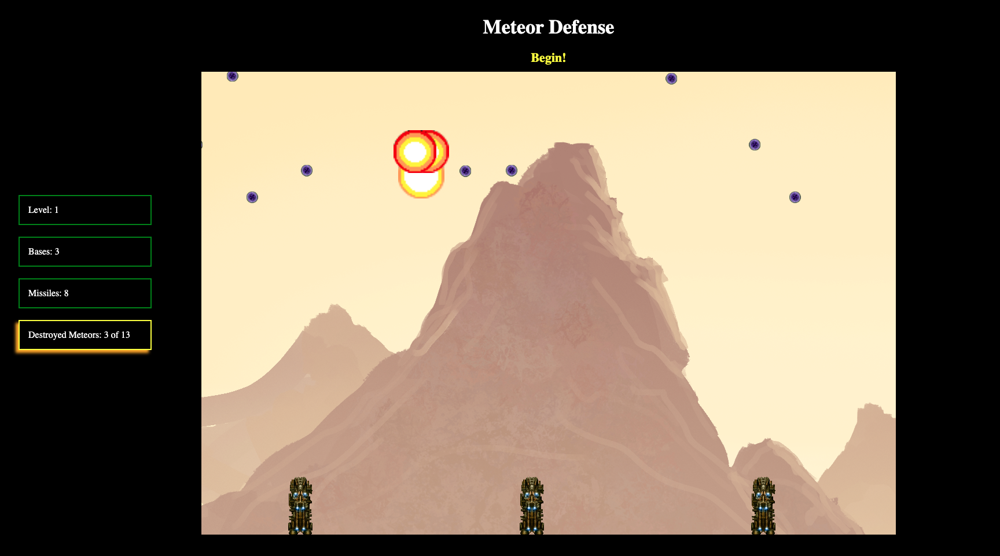

# Meteor-Defense
[Play Meteor Defense!](https://willhops01.github.io/Meteor-Defense/)



## How to Play
- Every level, players are given a certain number of Missiles
- Fire Missiles by clicking on the screen at the location where you want the missile to explode
- When a missile reaches its destination, it creates an expanding Explosions area
- Meteors caught in an Explosion also explode, allowing for "chaining" of Explosions
- Defend your 3 Bases at the bottom of the screen
- Advance to the next level by destroying the number of Meteors indicated on the left-hand side of your screen
- Enjoy!

## Technologies/Languages Used
Meteor Defense is written entirely in vanilla Javascript, using vanilla DOM manipulation to change/update html elements. 
The game-screen utilizes Javascript Canvas to render frame-by-frame object movement, detect object collision, and calculate the speed of the game and its objects.

## Implementation and Sample Code
So, the nitty gritty for the code-minded reader. There are two main files in this project, game.js and gameDisplay.js. Game.js is what controls the core logic for running the game, and is where the core requestAnimationFrame gameloop resides. Gameview is used to track and display the player's stats for the current game session, and render any additional displays such as the new game prompt.

The game start/loop logic is fairly interesting, and I will post a few snippets of code here to demonstrate how it works. When a user navigates to Meteor-Defense, a "keydown" event listener is added to the document called "waitForStart()", and the user is prompted to hit any key to begin a new game.

Once a key is pressed, waitForStart() triggers. 
```
waitForStart(){
    if (this.activeListener){
      this.backingAudio.play();
      this.gameDisplay.changeUserPrompt(1);
      this.resetGame();
      this.setupLevel();
      this.activeListener = false;
    }
  }
```
The activeListener bool is used to check whether or not this function should run on a keypress, as we only want it to run once to begin a new game (and again if and when the player loses/wins and wants to restart). Rather than removing the event listener from the doc, and then re-adding it on game over, I chose to go this route instead.

resetGame() simply resets the game state (creates new empty arrays for tracking game objects, and a few other setup items)
setupLevel() then instanties the objects we need to start a new game (or a new level), and increments the difficulty modifier used to increase things like meteor spawn rate and starting number. Finally, setupLevel then calls runGame().
```
runGame(){
    this.ctx.drawImage(this.background, 0, 0);    
    this.gameDisplay.nextLevel(this.gameLoop);
  }
```
```
nextLevel(callback){
    //level setup logic       
    this.setupLevelDisplay(); 
    if (this.level > 1){
      this.levelAudio.play(); 
    }
    this.ctx.fillStyle = "red";
    this.ctx.fillRect(500, 300, 250, 200);
    this.ctx.fillStyle = "yellow";
    this.ctx.strokeText(`Level ${this.level}`, 575,400);
    window.setTimeout(() => { callback(0); }, 2500);    
  }
  ```
  
  As you can see, we pass the gameLoop as a callback to the gameDisplay, which then renders a next level display depending on the current level (starts at 1), and once the 2500 ms timeout has occurred, invokes the passed callback.
  
  One of the most challenging parts of this project was understanding how the requestAnimationFrame DOMHighRestTimeStamp actually works, and molding this functionality to the purpose that I needed.
  
  ```
  gameLoop(timestamp){ 
   if (this.gameDisplay.checkContinue()){
      //game still progressing, player has neither won or lost
      let elapsedFrameTime = timestamp - this.lastTime;
      this.lastTime = timestamp;
      this.timer += elapsedFrameTime / 1000;
      
```
   The issue here is that the timestamp passed by requestAnimationFrame begins once the page loads, not when the function is called for the firstime.
   This means that if I use the code above, my frames draw correctly on all frames after the first, but the first frame actually jumps time forward from 0 to whenever the user actually decided to hit a key and begin their game. The same issue also arose in between levels, as there is a 2.5 second delay between levels again causing a "jump" in the animation.
   
   The way that I solved this issue was to use a boolean to check whether or not I was calling this function for the "first time" i.e. on game or level start. If true, I set my timestamps to be equal to the current timestamp, thus synchronizing the timers, and removing and the time difference issues I had been experiencing thus far.
```
   gameLoop(timestamp){  
    if (!this.startTime){
      this.startTime = timestamp;
      this.lastTime = this.startTime;
    }
    if (this.gameDisplay.checkContinue()){
      //game still progressing, player has neither won or lost
      let elapsedFrameTime = timestamp - this.lastTime;
      this.lastTime = timestamp;
      this.timer += elapsedFrameTime / 1000;
      }
```
Once the game or level ends, I simply reset this.startTime = null, thus ensuring that no matter how much time passes between levels or a new game, the first frame of my animation essentially starts at "0".
